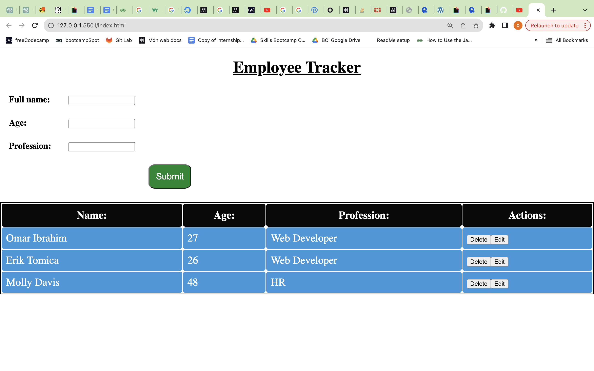

# Employee Tracker 

**Employee Tracker** is a web application that allows users to track and manage employee infromation.This file will provide an overview of the project and explain how to get started.

## Table of Contents 
1.  [Intorduction](#introduction)
2.  [Features](#features)
3.  [Requirements](#requirements)
4.  [Usage](#usage)
5.  [Screenshot](#screenshot)
6.  [Live Project](#live-project)
10. [Repository](#repository)

## Introduction

Employee Tracker is a simple web application that helps you keep track of employee data. It provides a user-friendly form for entering employee information and displays the data in a table format.

## Features

- Easy entry of employee details, including full name, age, and profession.
- Dynamic table that displays entered employee data.
- Basic validation to ensure accurate data entry.

## Requirements

To use Employee Tracker, you need:
- A web browser to view and interact with the application.
- A code editor for any any further development.

## Usage

1. Load the application in your browser
2. In the "Employee Tracker" form, enter employee information:
    - **Full Name:** Enter the employee's full name.
    - **age:** Enter the employee's age.
    - **Profession** Enter the employee's profession.

3. Click the "Submit" button to add the employee's data to the table. 

4. The entered data will apear in the table for "Name," "Age," "Profession," and "Actions."

5. You can further customize the application or add aditional functionality by editing the JavaScript file ('ob.js') in the project directory.

## Screenshot

## Live Project

[This is the link to the live project](https://omar12ahmed.github.io/employee-tracker/)

## Repository

[This is the link to the repo](https://github.com/omar12ahmed/calculator)

